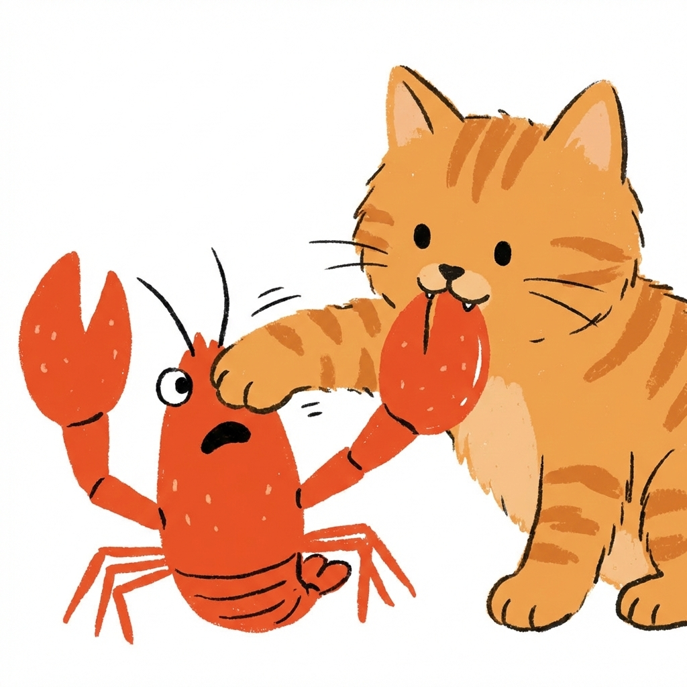

# 🐾 OpenPaw

<div align="center">
  
  <br/>
  <i><b>The Purr-fectly Powerful Cat AI Assistant</b></i>
  <br/>
  <i>Inspired by OpenClaw. Engineered in Rust. Built to land on all fours.</i>
</div>

---

OpenPaw is a high-performance, unapologetically modular AI Agent Runtime. Inspired by the legendary **OpenClaw**, OpenPaw is a spiritual successor written from the ground up in Rust for those who need a domestic AI that's as fast as a feline and twice as sharp.

Whether it's prowling through your file system, sniffing out data in technical datasheets, or pouncing on complex web automation tasks, OpenPaw is designed to be your most loyal—and technically superior—digital companion.

## 🚀 Why OpenPaw?
*   **Rust-Native Instincts 🦀:** Zero-cost abstractions and thread-safe concurrency for "purr-formance" that never lags.
*   **Claws-Out Automation:** Native support for I2C, SPI, and Serial communication to interact with the physical world.
*   **OpenClaw Heritage:** Fully compatible with the "Skills" philosophy, offering a familiar but "sharper" experience for OpenClaw enthusiasts.
*   **Hardware-Aware Senses:** A specialized RAG system that understands the "anatomy" of hardware (datasheets, pin-aliases, and board types).

## ✨ The Agent's Instincts (Features)

### 🤖 AI Providers

Connect to the best AI models through a unified interface. OpenPaw supports **7 providers out of the box**:

| Provider | Free Tier | Notes |
|---|---|---|
| **Gemini** | ✅ 15 req/min, 1M tokens/day | Google AI Studio key |
| **Gemini CLI** | ✅ No key needed | Reuses your existing `gemini` CLI OAuth session |
| **OpenAI** | ❌ | GPT-4o, o1, o3 |
| **Anthropic** | ❌ | Claude 3.5 / 3.7 |
| **OpenRouter** | ✅ 25+ free models | 200+ models via one key — **auto-detected** |
| **Kilo.ai** | ✅ Free + 200+ paid | Gateway to hundreds of models — **auto-detected** |
| **OpenCode** | ✅ | OpenCode Zen free models |
| **Ollama** | ✅ Fully local | No key needed, runs on your machine |

#### 🆓 Smart Free Model Detection
When you choose **OpenRouter** or **Kilo.ai** during setup, OpenPaw automatically:
- Fetches the full model list live from the provider's API
- **Filters for genuinely free models** (`pricing.prompt == 0`, `pricing.completion == 0`)
- For OpenRouter, enforces a **minimum 8,192-token context window** — filters out unusable tiny models, keeping only 32K–512K context ones useful for agents
- Presents a ranked list (largest context first) with a recommended default
- Saves remaining free models as **automatic runtime fallbacks**

#### 🔄 Automatic Runtime Fallback (Kilo.ai)
If your selected model fails (rate-limited, overloaded, unavailable), OpenPaw silently retries with the next free model in your fallback list — no interruption, no errors. Logged as warnings so you can see what happened.

```
WARN [kilocode] Model 'minimax/minimax-m2.1:free' failed: 429. Trying fallbacks…
WARN [kilocode] Succeeded with fallback model 'arcee-ai/trinity-large-preview:free'
```

---

### 🧠 Sophisticated Orchestration
*   **7-Tier Territory Routing:** Advanced logic that routes messages based on Peer, Guild, Team, Account, or Channel constraints. Your agent always knows its place.
*   **The Whisker-Thin Bus:** A high-throughput internal message bus (via `crossbeam-channel`) that orchestrates silent, deadly-efficient communication between modules.
*   **Persistent Memory:** SQLite-backed long-term memory with Full-Text Search (FTS5). OpenPaw remembers your preferences like a cat remembers its favorite sunny spot.

### 🛠️ Sharpening the Claws (The Toolbelt)
*   **MCP Host Implementation**: OpenPaw hosts and orchestrates Model Context Protocol (MCP) servers natively, expanding its "territory" to thousands of standardized tools.
*   **Hardware-Aware RAG**: A specialized sensory system for technical documentation. It parses markdown pin-aliases and provides the exact board-specific context needed for hardware hacks.
*   **Deep Web Prowling**: Powered by `browser-use`, OpenPaw navigates the web with human-like precision. Optimized for speed with **headless mode by default** and a specialized `read_page` action for clean Markdown extraction.
*   **Brave Search Integration**: High-quality web results via Brave's Search API. Returns rich, agent-friendly snippets for superior information gathering.
*   **Background Sub-agents**: OpenPaw can spawn and manage background workers for long-running tasks, allowing it to multi-task without blocking your main conversation.
*   **SkillForge Ecosystem**: Automatically scout and integrate community "Skills" from GitHub. Compatible with the NullClaw and OpenClaw ecosystems.

### 🔌 Multimodal Senses
*   **Hardware Gateway**: Native drivers for Serial (ACM/USB), I2C, and SPI. Control real-world hardware as easily as playing with a laser pointer.
*   **Multimodal Ears (Groq/Whisper)**: Bi-directional voice support. OpenPaw can "hear" Telegram voice notes and transcribe them instantly using ultra-low latency STT.
*   **Multi-Channel Prowling**: Robust adapters for **Telegram**, **CLI**, and **WhatsApp (Native)**. The WhatsApp integration uses Linked Device emulation (QR code scanning) for stable, official-API-free connectivity.

---

## 🛠️ Setting up the Litter Box (Build & Setup)

### Prerequisites
- Rust (latest stable)
- SQLite (bundled)
- A modern browser (Chrome/Edge/Brave) for web automation.

### ⚡ One-Line Install
**Windows (PowerShell):**
```powershell
powershell -ExecutionPolicy ByPass -Command "irm https://raw.githubusercontent.com/deviprasadshetty-dev/openpaw/main/install.ps1 | iex"
```

**Linux/macOS:**
```bash
curl -sSf https://raw.githubusercontent.com/deviprasadshetty-dev/openpaw/main/install.sh | bash
```

### Installation (Manual)

1.  **Clone & Build:**
    ```bash
    git clone https://github.com/deviprasadshetty-dev/openpaw.git
    cd openpaw
    cargo build --release
    ```

2.  **Install Globally:**
    To use OpenPaw from anywhere in your terminal:
    ```bash
    cargo install --path .
    ```

3.  **Onboarding (The "First Meow"):**
    Run the interactive setup wizard — now with a modern color terminal UI:
    ```bash
    openpaw onboard
    ```

    The wizard walks you through **6 focused steps** — only things that go into `config.json`:

    | Step | What it configures |
    |---|---|
    | **1. AI Provider** | Provider, API key, auto-fetch free models (OpenRouter/Kilo.ai) |
    | **2. Memory** | SQLite / Markdown / None + optional vector embeddings |
    | **3. Voice** | Groq Whisper transcription (free key at console.groq.com) |
    | **4. Telegram** | Bot token for mobile chat |
    | **5. Composio** | External app integrations (Gmail, GitHub, Slack…) |
    | **6. Web Search** | Brave Search API key for high-quality web results |

    No fluff — no questions about names or timezones that don't affect your agent's behaviour.

---

## 🏃 Deployment Territories

### 📡 The Resident Daemon
Run OpenPaw as a persistent background service to handle incoming calls from Telegram or webhooks:
```bash
openpaw agent
```

### ⚡ Quick Pounces (One-Shot)
Execute complex tasks directly from your terminal:
```bash
openpaw agent --message "Sniff out the CPU temperature and let me know if it's getting too hot."
```

---

## 🛡️ Security & Territory Isolation
OpenPaw is fiercely protective of its territory. File system access is strictly sandboxed. Web browsing occurs in ephemeral, isolated Chromium containers. All hardware interactions are subject to strict path-based permission checks.

---

<div align="center">
  <i>Developed with ❤️ for the Rust, AI, and Cat communities.</i>
  <br/>
  <b>May your agents always land on all fours.</b>
</div>
